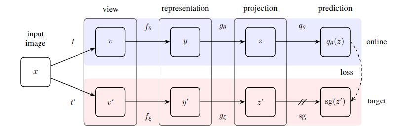

</img>

## Bootstrap Your Own Latent (BYOL), in Pytorch

[](https://badge.fury.io/py/byol-pytorch)

Practical implementation of an <a href="https://arxiv.org/abs/2006.07733">astoundingly simple method</a> for self-supervised learning that achieves a new state of the art (surpassing SimCLR) without contrastive learning and having to designate negative pairs.

This repository offers a module that one can easily wrap any image-based neural network (residual network, discriminator, policy network) to immediately start benefitting from unlabelled image data.

Update 1: There is now <a href="https://untitled-ai.github.io/understanding-self-supervised-contrastive-learning.html">new evidence</a> that batch normalization is key to making this technique work well

Update 2: A <a href="https://arxiv.org/abs/2010.10241">new paper</a> has successfully replaced batch norm with group norm + weight standardization, refuting that batch statistics are needed for BYOL to work

Update 3: It <a href="https://arxiv.org/abs/2011.10566">turns out</a> even the momentum encoder is not necessary. You can have fully functioning self-supervised learning without negative pairs nor the exponential moving average of the target encoder. I'll update BYOL later with a flag that will allow you to turn off the EMA and break feature parity with 'SimSiam'.

<a href="https://www.youtube.com/watch?v=YPfUiOMYOEE">Yannic Kilcher's excellent explanation</a>

## Install

```bash
$ pip install byol-pytorch
```

## Usage

Simply plugin your neural network, specifying (1) the image dimensions as well as (2) the name (or index) of the hidden layer, whose output is used as the latent representation used for self-supervised training.

```python
import torch
from byol_pytorch import BYOL
from torchvision import models

resnet = models.resnet50(pretrained=True)

learner = BYOL(
    resnet,
    image_size = 256,
    hidden_layer = 'avgpool'
)

opt = torch.optim.Adam(learner.parameters(), lr=3e-4)

def sample_unlabelled_images():
    return torch.randn(20, 3, 256, 256)

for _ in range(100):
    images = sample_unlabelled_images()
    loss = learner(images)
    opt.zero_grad()
    loss.backward()
    opt.step()
    learner.update_moving_average() # update moving average of target encoder

# save your improved network
torch.save(resnet.state_dict(), './improved-net.pt')
```

That's pretty much it. After much training, the residual network should now perform better on its downstream supervised tasks.

## BYOL → SimSiam

A <a href="https://arxiv.org/abs/2011.10566">new paper</a> from Kaiming He suggests that BYOL does not even need the exponential moving average updates of the target encoder (momentum). I've decided to build in this option so that you can easily use that variant for training. You will no longer need to invoke `update_moving_average` if you choose this route.

```python
import torch
from byol_pytorch import BYOL
from torchvision import models

resnet = models.resnet50(pretrained=True)

learner = BYOL(
    resnet,
    image_size = 256,
    hidden_layer = 'avgpool',
    use_momentum = False       # turn off momentum in the target encoder
)

opt = torch.optim.Adam(learner.parameters(), lr=3e-4)

def sample_unlabelled_images():
    return torch.randn(20, 3, 256, 256)

for _ in range(100):
    images = sample_unlabelled_images()
    loss = learner(images)
    opt.zero_grad()
    loss.backward()
    opt.step()

# save your improved network
torch.save(resnet.state_dict(), './improved-net.pt')
```

## Advanced

While the hyperparameters have already been set to what the paper has found optimal, you can change them with extra keyword arguments to the base wrapper class.

```python
learner = BYOL(
    resnet,
    image_size = 256,
    hidden_layer = 'avgpool',
    projection_size = 256,           # the projection size
    projection_hidden_size = 4096,   # the hidden dimension of the MLP for both the projection and prediction
    moving_average_decay = 0.99      # the moving average decay factor for the target encoder, already set at what paper recommends
)
```

By default, this library will use the augmentations from the SimCLR paper (which is also used in the BYOL paper). However, if you would like to specify your own augmentation pipeline, you can simply pass in your own custom augmentation function with the `augment_fn` keyword.

Augmentations must work in the tensor space. `kornia` library is highly recommended for this. If you decide to use torchvision augmentations, make sure the tensor is first converted to PIL `.toPILImage()`, and then back to tensors `.ToTensor()`

```python
augment_fn = nn.Sequential(
    kornia.augmentation.RandomHorizontalFlip()
)

learner = BYOL(
    resnet,
    image_size = 256,
    hidden_layer = -2,
    augment_fn = augment_fn
)
```

In the paper, they seem to assure that one of the augmentations have a higher gaussian blur probability than the other. You can also adjust this to your heart's delight.

```python
augment_fn = nn.Sequential(
    kornia.augmentation.RandomHorizontalFlip()
)

augment_fn2 = nn.Sequential(
    kornia.augmentation.RandomHorizontalFlip(),
    kornia.filters.GaussianBlur2d((3, 3), (1.5, 1.5))
)

learner = BYOL(
    resnet,
    image_size = 256,
    hidden_layer = -2,
    augment_fn = augment_fn,
    augment_fn2 = augment_fn2,
)
```

## Citation

```bibtex
@misc{grill2020bootstrap,
    title = {Bootstrap Your Own Latent: A New Approach to Self-Supervised Learning},
    author = {Jean-Bastien Grill and Florian Strub and Florent Altché and Corentin Tallec and Pierre H. Richemond and Elena Buchatskaya and Carl Doersch and Bernardo Avila Pires and Zhaohan Daniel Guo and Mohammad Gheshlaghi Azar and Bilal Piot and Koray Kavukcuoglu and Rémi Munos and Michal Valko},
    year = {2020},
    eprint = {2006.07733},
    archivePrefix = {arXiv},
    primaryClass = {cs.LG}
}
```
